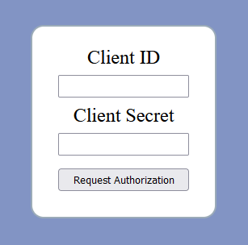
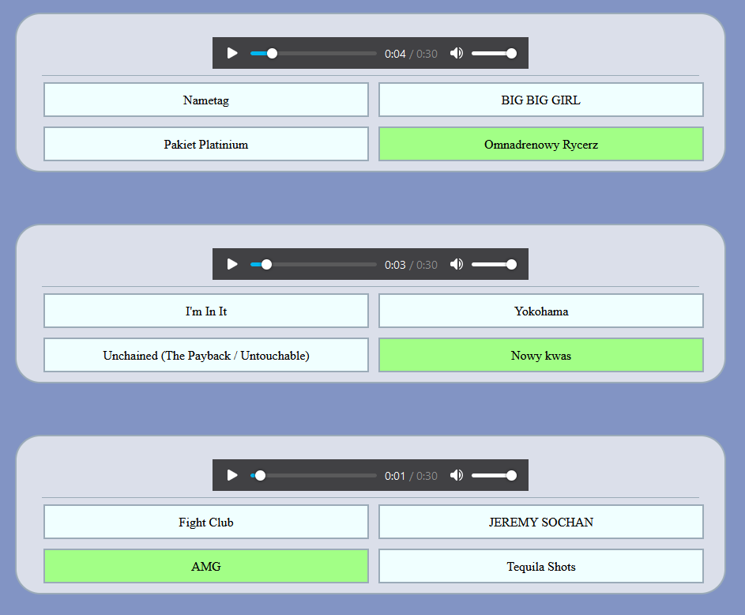

## What is the Spotify quiz?

Spotify quiz is an app that uses Spotify API to make quiz from your top 50 favourite songs.

    <h2>Login</h2>

    <h2>Start</h2>

    <h2>Quiz</h2>

    <h2>Result</h2>

## How to install Spotify quiz?

1. Common setup. Clone the repository and install all the dependencies.

- git clone https://github.com/Xenko10/spotify-quiz.git
- cd spotify-quiz
- npm install

2. Configure app at Spotify site.

- go to https://developer.spotify.com/dashboard
- create app
  a) it can have any name
  b) you have to type http://localhost:3000/ to "Website"
  c) you have to type exactly http://localhost:3000/auth/ to "Redirect URIs" (if you type http://localhost:3000/auth it won't work)

3. Run the following.

- node index.js
- open http://localhost:3000
- use Client ID and Client Secret from app that you created before
